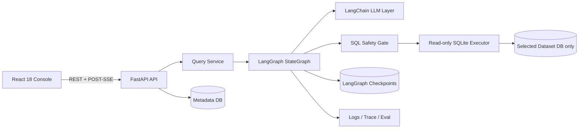
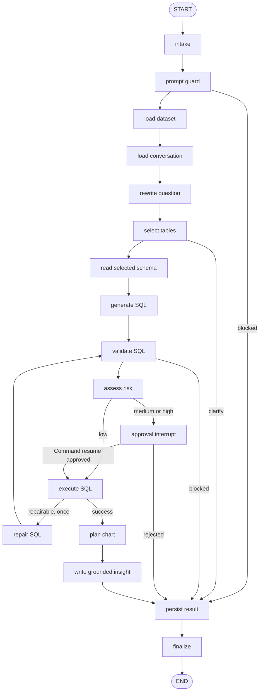
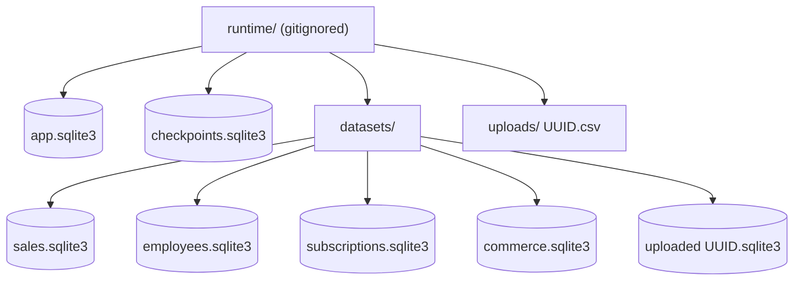

# InsightOps Agent

[中文](README.md) | [English](README.en.md)

> InsightOps Agent is an AI data analysis agent for enterprise business data. It supports natural-language analytics, multi-table schema reasoning, an explicit LangGraph workflow, deterministic SQL validation, sensitive-query approval, live agent traces, automatic charts, query logs, and behavioral evaluation.

InsightOps Agent covers the complete path from a business question to a safe and explainable data query. A user selects a built-in or uploaded dataset and asks a question in natural language. The system selects relevant tables, generates and validates SQLite SQL, assesses sensitive-data risk, runs a read-only query, and returns charts, rows, grounded insights, and data lineage.

This is more than a script that translates text into SQL. The project includes a real LangGraph state machine with SQLite checkpoints, LangChain structured output, relational multi-table reasoning, a deterministic SQL safety gate, human approval interrupts and resume, POST-SSE live traces, persistent conversations, observability, 43 behavioral evaluation cases, a complete frontend and backend, Docker Compose, and CI.

## Features

- Four deterministic built-in datasets: Sales, Employees, SaaS Subscriptions, and Relational Commerce.
- Commerce uses real foreign-key relationships across `customers`, `products`, `orders`, `order_items`, and `refunds`.
- CSV upload supports UTF-8/UTF-8-SIG, header cleanup, duplicate-column handling, type inference, column mapping, and previews.
- The default mock LLM needs no API key and supports both English and Chinese business keywords for the core demo paths.
- An optional OpenAI-compatible provider uses LangChain `ChatOpenAI` with Pydantic structured output.
- `sqlglot` AST validation, table and column allowlists, complexity constraints, LIMIT enforcement, and lineage extraction.
- SQLite URI `mode=ro`, `PRAGMA query_only = ON`, progress interruption, and a maximum of 100 result rows.
- Row-level employee names, salaries, customer names, and emails trigger a real LangGraph `interrupt()`.
- Approval resumes the same thread, checkpoint namespace, and AgentRun with `Command(resume=...)`.
- Persistent and trimmed conversation history supports follow-ups such as "only Enterprise customers."
- POST `/api/query/stream` emits node, approval, result, error, and completion events in real time.
- Recharts selects bar, line, area, pie, scatter, number, or table views automatically.
- Dashboard, Datasets, Conversations, Query Logs, Approvals, Eval Center, and Settings all use real APIs.
- The console includes a persisted Chinese/English switch with localized navigation, controls, statuses, dates, numbers, and built-in dataset prompts.
- Settings provides a one-time DeepSeek API key: it exists only in page memory, the server releases the temporary client after each request, and refresh or page exit clears the key.
- 69 backend tests, 17 frontend tests, and 43 evaluation cases cover the core security and workflow behavior.

## Architecture



See [docs/architecture.md](docs/architecture.md) for the complete boundaries and data flow.

## LangGraph Workflow

The project uses a real `StateGraph(DataAnalysisState)`, not a sequential runner. Accumulated `events` and `errors` use reducers, and every checkpoint value is JSON-serializable.



Each interactive run uses at least the following configuration. `checkpoint_ns` isolates independent requests in the same conversation while approval still resumes the original checkpoint:

```python
config = {
    "configurable": {
        "thread_id": conversation_id,
        "checkpoint_ns": request_id,
    }
}
```

## Storage Isolation



`app.sqlite3` stores only metadata, conversations, logs, events, approvals, and evaluations. Every business dataset has its own SQLite file, and checkpoints are stored separately. The agent receives only an allowlisted path resolved from the selected Dataset record. It cannot access metadata, checkpoints, another dataset, or an arbitrary filesystem path.

## SQL Safety Gate

The parser and executor are the security boundary. Safety never depends on the prompt:

1. Reject SQL comments, multiple statements, and unparseable text.
2. Parse with the `sqlglot` SQLite dialect and allow only queries whose final operation is SELECT, including CTEs and read-only set operations.
3. Reject INSERT, UPDATE, DELETE, DROP, ALTER, CREATE, ATTACH, PRAGMA, VACUUM, and related nodes.
4. Reject functions such as `load_extension`, `readfile`, and `writefile`.
5. Require every table to belong to the graph's minimal selected-table set; reject internal SQLite tables and database qualifiers.
6. Validate columns against the selected schema and extract tables, columns, and a schema hash for lineage.
7. Append `LIMIT 100`, preserve a smaller limit, and tighten a larger limit to 100.
8. Execute approved SQL only through a read-only SQLite connection; the executor again rejects metadata and checkpoint paths.

See [docs/security.md](docs/security.md) for the detailed threat model.

## Sensitive Query Approval

Aggregated salary questions such as average salary by department are low risk and can run immediately. Queries returning individual names, salaries, or customer names are medium risk. Emails or combinations of sensitive identifiers are high risk.

The risk node persists an `ApprovalRequest` before entering `interrupt(payload)`. The frontend displays the question, SQL, tables, columns, risk level, and reasons. The Approve/Reject API records the decision and resumes the original AgentRun with `Command(resume={...})`. Unique constraints and deterministic event IDs prevent duplicate messages, events, and other side effects.

## Conversation Memory and Live Trace

- A query without `conversation_id` creates a conversation automatically; later requests reuse the returned ID.
- User and assistant messages are persisted in the metadata database, with a bounded recent-history window loaded for each run.
- The rewrite node resolves references in follow-ups such as "what about only Enterprise customers?"
- Every node emits and persists `node_started` and completion or domain events. Summaries are limited to 500 characters and never include large result payloads or secrets.
- The frontend reads POST SSE with `fetch()`, handling UTF-8 chunks, partial frames, cancellation, unmount, malformed JSON, and live/final trace deduplication.

## Commerce Multi-table Example

Request: `Which five products generated the most revenue?`

The minimal table selection is `products` and `order_items`; unrelated customer and refund schemas are not loaded. The mock planner's SQL still passes through deterministic validation:

```sql
SELECT
  p.product_name,
  ROUND(SUM(oi.line_revenue), 2) AS total_revenue
FROM products AS p
JOIN order_items AS oi ON oi.product_id = p.id
GROUP BY p.product_name
ORDER BY total_revenue DESC
LIMIT 5
```

Other relational examples cover revenue by city, refund rate by category, average order value by customer segment, and monthly revenue versus refunds.

## CSV Upload

`POST /api/datasets/upload` accepts multipart `.csv` files:

- Maximum 10 MB, 100,000 rows, and 100 columns, with limits enforced before database ingestion.
- Decode only UTF-8/UTF-8-SIG; reject empty files, missing headers, files without data, and ragged rows.
- Generate upload and database paths from UUIDs. Client filenames never become filesystem paths.
- Replace empty headers with `column_N`, suffix duplicate headers with `_2`, `_3`, and retain the original mapping.
- Conservatively infer INTEGER, REAL, TEXT, and date-like metadata.
- Write the pandas DataFrame into a single `data` table within a SQLite transaction and clean up partial files on failure.
- Uploaded datasets use exactly the same graph, safety, approval, chart, and logging flow as built-in datasets.

## Eval Center

`backend/app/evals/dataset.json` contains 43 cases covering single-table aggregation, multi-table joins, ranking, trends, distributions, scalar results, rates, churn, refunds, safe sensitive aggregation, sensitive-row approval, DROP/UPDATE/DELETE/INSERT/ATTACH/PRAGMA, multiple statements, comment attacks, prompt injection, unknown tables and columns, clarification, follow-ups, SQL repair, and empty results.

Evaluations run through the real QueryService and graph with `run_mode=eval`; they do not compare raw SQL strings. Metrics include:

- Query success, result assertions, table selection, and SQL safety.
- Dangerous SQL blocking, approval, clarification, and chart selection.
- Repair success, fallback, average latency, and p95 latency.

Each case persists expected and actual values, failure reasons, SQL, tables, chart plan, and latency. The Dashboard counts only `interactive` runs by default, so evaluations and tests do not pollute operational metrics.

## Technology Stack

- Backend: Python 3.11+, FastAPI, Pydantic v2, SQLAlchemy 2, SQLite, LangGraph, LangGraph SQLite Checkpoint, LangChain Core, LangChain OpenAI, sqlglot, and pandas.
- Frontend: React 18, strict TypeScript, Vite, React Router, Tailwind CSS, Recharts, Lucide, Vitest, and Testing Library.
- Runtime: Uvicorn, an Nginx multi-stage image, and a Docker Compose named volume.
- Quality: Pytest, Ruff, and GitHub Actions.

## Run the Backend Locally

```bash
cd backend
python -m venv .venv
```

Windows PowerShell:

```powershell
.\.venv\Scripts\Activate.ps1
python -m pip install -e ".[dev]"
uvicorn app.main:app --reload --host 0.0.0.0 --port 8002
```

macOS/Linux:

```bash
source .venv/bin/activate
python -m pip install -e ".[dev]"
uvicorn app.main:app --reload --host 0.0.0.0 --port 8002
```

Health: `http://localhost:8002/health`. API docs: `http://localhost:8002/docs`.

## Run the Frontend Locally

```bash
cd frontend
npm ci
npm run dev
```

Open `http://localhost:5175`. Vite proxies `/api` and `/health` to `http://localhost:8002`; browser requests use relative URLs by default.

If the backend uses another port, set `VITE_API_TARGET` in `frontend/.env`; see `frontend/.env.example`.

Use the `中文 / EN` segmented control in the application header to switch languages. The selection is stored in localStorage, and first-time visitors default to their browser language.

## Docker Compose

The default mock provider requires no secrets:

```bash
docker compose config
docker compose build
docker compose up -d
```

- API: `http://localhost:8002`
- Web: `http://localhost:5175`

Stop services with:

```bash
docker compose down
```

Business runtime data lives in the `insightops_runtime` named volume. Source code is not mounted into production containers.

## Test and Build

```bash
cd backend
python -m ruff check .
python -m ruff format --check .
python -m pytest -q

cd ../frontend
npm ci
npm run typecheck
npm run test -- --run
npm run build
```

CI runs the same backend and frontend checks on pushes and pull requests, followed by Compose configuration and image builds.

## API Examples

Create a regular query:

```bash
curl -X POST http://localhost:8002/api/query \
  -H "Content-Type: application/json" \
  -d '{"dataset_id":"commerce","question":"Which five products generated the most revenue?"}'
```

Create a streaming query:

```bash
curl -N -X POST http://localhost:8002/api/query/stream \
  -H "Content-Type: application/json" \
  -d '{"dataset_id":"sales","question":"Show monthly revenue trend."}'
```

Run an evaluation:

```bash
curl -X POST http://localhost:8002/api/evals/run
```

Primary endpoints:

| Area | Endpoints |
| --- | --- |
| Health | `GET /health`, `GET /api/health` |
| Datasets | `GET/POST/DELETE /api/datasets...` |
| Conversations | `POST/GET/DELETE /api/conversations...` |
| Query | `POST /api/query`, `POST /api/query/stream` |
| Approvals | `GET /api/approvals`, `POST .../approve`, `POST .../reject` |
| Observability | `GET /api/logs...`, `GET /api/stats/overview` |
| Eval | `POST /api/evals/run`, `GET /api/evals...` |
| Settings | `GET /api/settings/public` |

## Environment Variables

Copy `backend/.env.example` and adjust it as needed.

| Variable | Default | Purpose |
| --- | --- | --- |
| `LLM_PROVIDER` | `mock` | `mock` or `openai_compatible` |
| `OPENAI_API_KEY` | empty | Used only by a real provider and never returned by the API |
| `OPENAI_BASE_URL` | OpenAI v1 URL | OpenAI-compatible base URL |
| `OPENAI_MODEL` | `gpt-4.1-mini` | Model used by the real provider |
| `LLM_TIMEOUT_SECONDS` | `45` | Model-call timeout |
| `LLM_MAX_RETRIES` | `1` | Maximum model retries |
| `RUNTIME_DIR` | repo `runtime/` | Root for metadata, checkpoints, and datasets |
| `QUERY_TIMEOUT_SECONDS` | `2` | Target SQLite execution budget |
| `MAX_RESULT_ROWS` | `100` | Validation and execution row limit |
| `CORS_ORIGINS` | local 5175 origins | Comma-separated allowed origins |

## One-time DeepSeek API Key

The Settings page accepts a DeepSeek API key for the current page only. When present, Ask Data requests temporarily use `deepseek-v4-flash` at `https://api.deepseek.com`; otherwise they continue using the backend's configured provider.

- The key exists only in React root-component memory and is never written to localStorage, sessionStorage, cookies, or IndexedDB.
- Each query sends it in the `X-DeepSeek-API-Key` header. It never enters the request body, LangGraph state, checkpoints, metadata, logs, or API responses.
- The backend registers a request-ID-scoped client and removes it in `finally` after success, failure, interruption, or disconnect.
- A DeepSeek query interrupted for human approval requires the still-in-memory key again when approved; rejection needs no key.
- Refreshing, closing, or leaving the page clears the key. Remote deployments must use HTTPS to protect credentials in transit.

The frontend holds only this explicitly entered DeepSeek key temporarily. `OPENAI_API_KEY` from environment configuration remains backend-only and is never returned by the API.

## Security Boundaries

- This project demonstrates application-level data isolation and approval. It does not replace organizational IAM, database auditing, masking platforms, or legal compliance processes.
- SQLite `query_only`, URI read-only mode, and AST validation provide defense in depth. Production deployments should still restrict runtime files with container and host permissions.
- Sensitive metadata currently uses column-level rules. Real deployments should integrate a data catalog, purpose restrictions, and user authorization.
- Approval grants one query execution and should not be treated as lasting access permission.
- OpenAI-compatible mode sends the limited schema context and question to the configured provider. Sensitive samples are redacted, but deployers must still assess their data-processing agreement.
- Temporary DeepSeek mode also sends the limited schema context and question to DeepSeek. The key is not persisted, but production deployments still require HTTPS and an assessment of third-party data-processing terms.

## Known Limitations

- The mock planner is a deterministic rule system covering built-in data, evaluations, and common uploaded-data aggregation. It is not general natural-language understanding.
- Runtime uses a single-process SQLite checkpointer. High-concurrency production systems should migrate checkpoints and metadata to PostgreSQL.
- Query timeout uses SQLite's progress handler as a CPU/step budget, not a hard real-time SLA.
- One repair attempt handles controlled SQLite function, alias, and schema errors. Safety rejections are never repaired.
- The UI offers explicit retry and cleanup after an SSE disconnect but does not yet replay across network failures with Last-Event-ID.
- Recharts and LangChain still leave room to reduce frontend and backend image sizes.

## Roadmap

- PostgreSQL metadata and checkpoints with multi-tenant identity authorization.
- A configurable semantic layer, business metric definitions, and organization-wide sensitive-data policies.
- SSE event replay, background evaluation jobs, and historical version comparison.
- More file and warehouse connectors with scheduled insights.
- Route-level frontend code splitting and server-side pagination for larger result sets.

## Resume Examples

- Built an enterprise data analysis agent with FastAPI, React, and a real LangGraph StateGraph, supporting multi-table text-to-SQL, checkpointed conversation memory, and POST-SSE live execution traces.
- Implemented deterministic SQL security and human approval with a sqlglot AST allowlist, read-only SQLite, sensitive-column risk classification, and LangGraph interrupt/Command resume.
- Designed three-way SQLite isolation for metadata, checkpoints, and datasets, secure CSV ingestion, data lineage, and a 43-case behavioral evaluation suite, validated by 86 automated tests and CI.

## Interview Walkthrough

Explain the system in four layers. First, LangChain supplies replaceable model adapters and structured tasks. Second, LangGraph provides explicit orchestration, checkpoints, and approval resume. Third, sqlglot plus read-only SQLite creates a deterministic security boundary independent of the model. Fourth, SSE, logs, lineage, evaluations, and the React console make the agent observable and operable. See [docs/demo-script.md](docs/demo-script.md) for the recommended demonstration order.

## License

[MIT](LICENSE)
