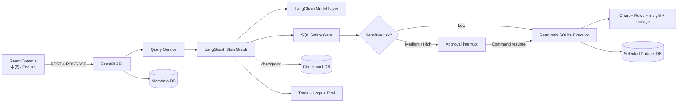

<div align="center">

# InsightOps Agent

**把业务问题安全、可解释地落到真实数据查询的 AI 数据分析 Agent。**

**简体中文** | [English](README.en.md)

[](https://github.com/ab2956955606-cmyk/Data_Agent/actions/workflows/ci.yml)


[](LICENSE)

</div>


InsightOps Agent 覆盖从自然语言问题到可信分析结果的完整链路：理解关系型 Schema、选择最小必要表、生成 SQL、执行确定性安全校验、评估敏感风险、只读查询、规划图表、生成有数据依据的洞察，并把每一步作为实时 Agent Trace 呈现。

默认 Mock 模式无需 API Key，克隆后即可完整演示。真实模型模式支持 OpenAI-compatible provider，以及仅存在于当前页面内存中的一次性 DeepSeek Key。

## 先看结论

| 证据 | 当前实现 |
| --- | --- |
| 真实 Agent 工作流 | LangGraph `StateGraph`、SQLite checkpoint、`interrupt()` 与 `Command(resume=...)` |
| 确定性安全边界 | `sqlglot` AST、表列白名单、只读 SQLite、超时和最大 100 行 |
| 可观测性 | POST-SSE 节点事件、完整 Trace、Query Logs、Lineage、Dashboard |
| 数据能力 | 四个内置业务数据集、Commerce 五表关系模型、受限 CSV 上传 |
| 双语体验 | 中文/英文界面、状态、日期、数字、数据集说明与示例问题 |
| 验证规模 | 102 项后端测试、19 项前端测试、43 条内置 Eval、50 条开放数据评测 |

## 为什么它不只是 Text-to-SQL

| 常见演示 | InsightOps Agent |
| --- | --- |
| 一次提示词直接返回 SQL | 显式图工作流，节点、分支和状态均可追踪 |
| 把完整数据库结构交给模型 | 先选表，再渐进披露相关 Schema |
| 依赖提示词要求模型“安全” | 模型输出必须经过独立 AST Safety Gate |
| 默认拥有数据库写权限 | 每个数据集独立 SQLite，只读 URI 加 `query_only` |
| 敏感结果直接返回 | 行级敏感查询触发持久化审批并中断图 |
| 只展示最终答案 | 同时返回 SQL、图表、数据行、洞察、血缘和 Trace |
| 用字符串匹配评价 SQL | 通过真实服务层执行并用独立 SQLite oracle 验证结果 |

## 产品实拍

### 问题、结果与执行轨迹

下面的 Commerce 查询运行在无密钥 Mock 模式。界面同时展示自动图表、结果行、已校验 SQL、数据血缘和真实节点事件。


### 中外真实开放数据

数据集注册表保留 USGS、NOAA、World Bank 和中国国家统计局快照。中文原始表头映射到安全 ASCII 列名，原始语义通过 JSON 转义别名进入模型上下文。


## 一个问题如何完成

1. API 创建或加载 Conversation，并预先持久化 `processing` QueryLog 与 AgentRun。
2. Prompt Guard 把用户指令视为不可信输入，拦截明显的数据破坏或绕过意图。
3. LangGraph 加载数据集和裁剪后的会话历史，选择回答问题所需的最小表集合。
4. 只向模型披露已选表的 Schema、外键、脱敏样本和原始列名别名。
5. LLM 生成结构化 SQL；Safety Gate 解析 AST，检查语句、表、列、复杂度和 LIMIT。
6. 风险评估允许低风险聚合直接执行，对行级薪资、姓名、邮箱等结果触发审批中断。
7. 已批准 SQL 只在选中数据集的只读连接中运行；受控执行错误最多修复一次，安全拒绝永不修复。
8. 系统基于真实返回行规划图表、生成克制洞察、保存血缘与事件，并通过 SSE 返回最终结果。

## 架构



Metadata、LangGraph checkpoint 和用户可查询数据始终位于不同 SQLite 文件中。完整边界、节点和数据流见 [架构说明](docs/architecture.md)。

## 安全模型

Prompt 负责提供上下文，不负责授权。真正的安全边界位于模型调用之后。

| 边界 | 确定性控制 |
| --- | --- |
| SQL 语法 | 只接受单条可解析查询；拒绝多语句和隐藏注释攻击 |
| 操作类型 | 只允许 `SELECT` / 只读 CTE；拒绝 DDL、DML、PRAGMA、ATTACH 等 |
| 数据范围 | 只允许访问当前数据集的已知表和列，拒绝 SQLite 内部表 |
| 执行能力 | SQLite URI `mode=ro`，并设置 `PRAGMA query_only = ON` |
| 资源限制 | LIMIT 自动追加或收紧到 100，使用 progress handler 中断超时查询 |
| 敏感数据 | 聚合可直接执行；行级姓名、薪资、邮箱等查询持久化审批并暂停图 |
| 密钥 | API 不返回密钥；事件、checkpoint、日志和评测报告不持久化密钥 |

更完整的威胁模型、绕过测试和生产部署注意事项见 [安全说明](docs/security.md)。

## 真实 DeepSeek 与开放数据评测

以下是截至 `2026-07-13` 的可复现快照。开放数据标准答案全部由独立 SQLite oracle SQL 计算，DeepSeek 不参与生成答案。

| 评测 | 全指标通过 | 结果准确率 | 图表准确率 | SQL 安全拦截 | Provider / fallback |
| --- | ---: | ---: | ---: | ---: | ---: |
| 43 条内置 DeepSeek Eval | 35 / 43 | 100% | 81.48% | 100% | DeepSeek / 0% |
| 25 条中英开放数据 | 16 / 25 | 80.95% | 66.67% | 100% | 100% / 0% |
| 25 条纯中文开放数据 | 14 / 25 | 66.67% | 71.43% | 100% | 100% / 0% |
| 优化后中英文各 20 条 | 40 / 40 | 100% | 100% | 不适用 | DeepSeek / 0% |

真实数据覆盖 USGS 近 30 天地震、NOAA JFK 2025 日气象、World Bank 2015 至 2024 国家指标，以及《中国统计年鉴 2025》中的 31 个大陆省级地区。报告保留每条问题、SQL、oracle 行、实际行、图表、fallback、耗时和失败原因，没有用 Mock 结果覆盖未达标项。

- [评测方法、来源与快照哈希](docs/real-data-evaluation.md)
- [43 条内置 DeepSeek 结果](docs/deepseek-builtin-evaluation-results.md)
- [25 条中英开放数据结果](docs/real-data-evaluation-results.md)
- [25 条纯中文开放数据结果](docs/real-data-evaluation-results.zh-CN.md)
- [2026-07-12 中英文各 20 条真实 DeepSeek 运行汇总](docs/deepseek-bilingual-40-results.md)（[完整 JSON](docs/deepseek-bilingual-40-results.json)：39 条成功、1 条审批后停留在 processing、fallback 0）
- [2026-07-13 优化复测与逐项提升](docs/deepseek-bilingual-40-optimization-report.md)（[完整 JSON](docs/deepseek-bilingual-40-optimized-results.json)，[oracle 评分](docs/deepseek-bilingual-40-optimized-score.json)：结果与图表均为 40/40，fallback 0）

## 五分钟启动

### 1. 后端

要求 Python 3.11+。

```bash
git clone https://github.com/ab2956955606-cmyk/Data_Agent.git
cd Data_Agent/backend
python -m venv .venv
```

激活虚拟环境：

```powershell
# Windows PowerShell
.\.venv\Scripts\Activate.ps1
```

```bash
# macOS / Linux
source .venv/bin/activate
```

安装并启动：

```bash
python -m pip install -e ".[dev]"
uvicorn app.main:app --reload --host 0.0.0.0 --port 8002
```

### 2. 前端

另开一个终端：

```bash
cd Data_Agent/frontend
npm ci
npm run dev
```

打开 `http://localhost:5175`。前端把 `/api` 和 `/health` 代理到 `http://localhost:8002`。默认 provider 为 Mock，不需要任何密钥。

| 地址 | 用途 |
| --- | --- |
| `http://localhost:5175` | Web 控制台 |
| `http://localhost:8002/health` | 服务健康检查 |
| `http://localhost:8002/docs` | OpenAPI 文档 |

<details>
<summary><strong>使用 Docker Compose</strong></summary>

```bash
docker compose config
docker compose build
docker compose up -d
```

Web 使用 `5175`，API 使用 `8002`。业务数据写入 `insightops_runtime` named volume。停止服务：

```bash
docker compose down
```

</details>

## 一次性 DeepSeek Key

在 `http://localhost:5175/settings` 输入 Key 后，当前页面中的 Ask Data 与 Eval 请求会临时使用 `deepseek-v4-flash`、非思考模式和 2,048-token 输出上限。

- Key 只存在于 React 根组件内存，不写入 localStorage、sessionStorage、Cookie 或 IndexedDB。
- 每次请求通过 `X-DeepSeek-API-Key` 发送，后端按请求创建临时客户端并在 `finally` 清理。
- Key 不进入请求体、LangGraph state、checkpoint、metadata、日志或 API 响应。
- 刷新、关闭页面或离开相关页面会清空 Key；远程部署必须使用 HTTPS。
- 默认 Mock 路径和完整测试不依赖任何外部模型或 Secret。

长期运行也可通过 `backend/.env` 配置 `LLM_PROVIDER=openai_compatible`、`OPENAI_API_KEY`、`OPENAI_BASE_URL` 和 `OPENAI_MODEL`。安全默认值见 [backend/.env.example](backend/.env.example)。

## 最短 API 路径

普通查询：

```bash
curl -X POST http://localhost:8002/api/query \
  -H "Content-Type: application/json" \
  -d '{"dataset_id":"commerce","question":"Which five products generated the most revenue?"}'
```

实时 Trace 使用 `POST /api/query/stream`，前端通过 fetch 解析 POST-SSE。审批、会话、数据集、日志、统计和 Eval 的完整契约可在启动后的 `/docs` 查看。

## 技术栈

| 层 | 技术 |
| --- | --- |
| Agent | LangGraph、LangChain Core、LangChain OpenAI、Pydantic structured output |
| Backend | FastAPI、SQLAlchemy 2、SQLite、pandas、Uvicorn |
| SQL | sqlglot AST、只读 SQLite URI、progress handler |
| Frontend | React 18、TypeScript strict、Vite、React Router、Tailwind CSS |
| Visualization | Recharts、bar / line / area / pie / scatter / number / table |
| Quality | Pytest、Ruff、Vitest、Testing Library、GitHub Actions |
| Delivery | Docker、Nginx、Docker Compose named volume |

## 测试与构建

```bash
cd backend
python -m ruff check .
python -m ruff format --check .
python -m pytest -q

cd ../frontend
npm ci
npm run typecheck
npm run test -- --run
npm run build
```

测试覆盖初始化、关系型 Schema、CSV 边界、路径穿越、SQL 攻击、图分支、会话追问、审批恢复、SSE 顺序、日志统计、临时密钥生命周期和真实 Eval 服务层。

## 深入阅读

| 文档 | 内容 |
| --- | --- |
| [docs/architecture.md](docs/architecture.md) | 模块边界、LangGraph 节点、状态与存储隔离 |
| [docs/security.md](docs/security.md) | SQL Safety Gate、审批、威胁模型与生产限制 |
| [docs/demo-script.md](docs/demo-script.md) | 正常查询、多表 JOIN、攻击拦截、审批恢复和 CSV 演示 |
| [docs/real-data-evaluation.md](docs/real-data-evaluation.md) | 官方数据来源、转换、oracle 与评测方法 |
| [docs/deepseek-bilingual-40-results.md](docs/deepseek-bilingual-40-results.md) | 2026-07-12 中英文各 20 条真实 DeepSeek 运行结果 |
| [docs/deepseek-bilingual-40-optimization-report.md](docs/deepseek-bilingual-40-optimization-report.md) | 2026-07-13 优化前后准确率、逐项差值与完整证据 |
| [IMPLEMENTATION_REPORT.md](IMPLEMENTATION_REPORT.md) | 已实现功能、验证命令、依赖与已知限制 |

## 已知限制与路线图

当前限制：Mock planner 是确定性规则系统；单进程 SQLite checkpoint 不面向高并发生产；SSE 尚未实现跨网络断线的事件重放；真实模型具有非确定性，本次 40/40 仅代表固定快照与预定义问题的最新试次。

下一步优先级：PostgreSQL metadata/checkpoint、多租户身份与用途授权、可配置语义层、SSE event replay、后台 Eval job、历史模型对比和前端 route-level code splitting。

## 作品集说明

可用于简历的描述：

- 构建基于 LangGraph 的全栈 AI 数据分析 Agent，支持关系型多表推理、POST-SSE Trace、会话记忆和人工审批恢复。
- 设计独立于提示词的 SQL 安全边界，通过 sqlglot AST、表列白名单和只读 SQLite 阻断 DDL、DML 与跨数据集访问。
- 建立 43 条行为 Eval 与 50 条中外开放数据评测，使用独立 SQLite oracle 报告真实结果、图表和安全准确率。

60 秒讲解：

> 这个项目的重点不是让模型写出一条 SQL，而是把不可信模型放进一条可观察、可中断、可验证的工程链路。LangGraph 管理状态和审批恢复，sqlglot 与只读执行器承担安全边界，SSE 暴露真实节点进度，独立 oracle 负责评测答案。默认 Mock 模式保证任何人都能复现核心流程，真实 DeepSeek 报告则保留成功与失败，不用演示数据掩盖问题。

## License

本项目采用 [MIT License](LICENSE)。

---

**简体中文** | [English](README.en.md)
