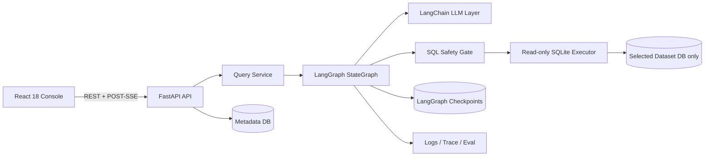
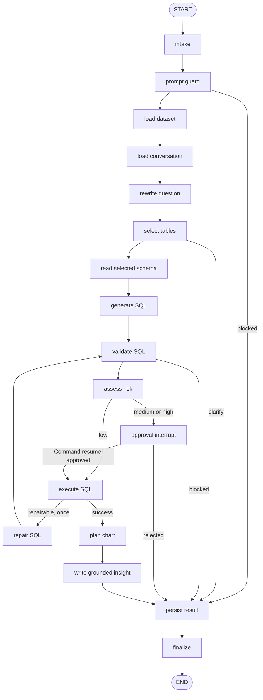
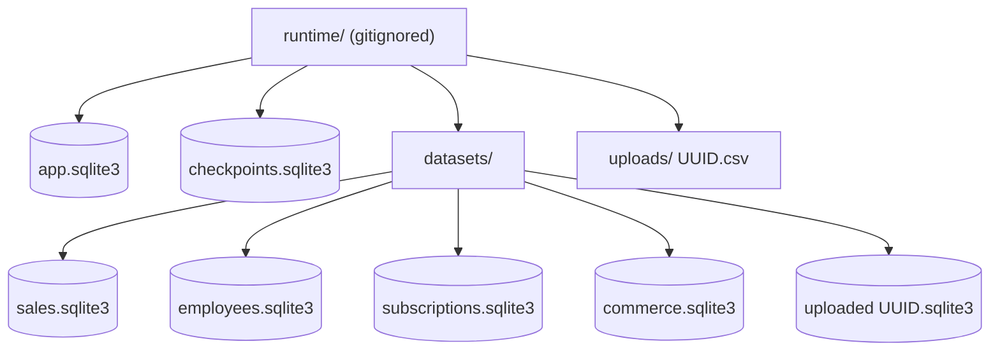

# InsightOps Agent

[中文](README.md) | [English](README.en.md)

> InsightOps Agent 是一个面向企业业务数据的 AI 数据分析 Agent，支持自然语言问数、多表 Schema 理解、LangGraph 工作流、SQL 安全校验、敏感查询审批、实时 Agent Trace、自动图表、查询日志和 Eval 评测。

InsightOps Agent 解决的是“业务问题如何安全、可解释地落到真实数据查询”这一整条链路。用户选择内置或上传的数据集，用自然语言提问，系统会选择相关表、生成并校验 SQLite SQL、判断敏感风险、执行只读查询，再返回图表、表格、洞察与数据血缘。

它不是一个只把问题翻译成 SQL 的演示脚本。项目包含真实 LangGraph 状态机和 SQLite checkpoint、LangChain 结构化输出、关系型多表推理、确定性 SQL Safety Gate、人机审批中断与恢复、POST-SSE 实时轨迹、持久会话、可观测日志、43 条行为评测、完整前后端、Docker Compose 与 CI。

## 功能概览

- 四个确定性内置数据集：Sales、Employees、SaaS Subscriptions、Relational Commerce。
- Commerce 使用 `customers`、`products`、`orders`、`order_items`、`refunds` 的真实外键关系。
- CSV 上传支持 UTF-8/UTF-8-SIG、列名清洗、重复列处理、类型推断、映射和预览。
- 默认 Mock LLM 无需 API Key，英文和中文业务关键词均可演示核心流程。
- 可选 OpenAI-compatible provider，使用 LangChain `ChatOpenAI` 与 Pydantic 结构化输出。
- `sqlglot` AST 校验、表/列白名单、复杂度约束、LIMIT 追加/收紧和数据血缘提取。
- SQLite URI `mode=ro`、`PRAGMA query_only = ON`、进度中断和最大 100 行。
- 员工姓名/薪资、客户姓名/邮箱等行级敏感结果触发真实 LangGraph `interrupt()`。
- 审批使用 `Command(resume=...)` 恢复同一 thread、checkpoint namespace 和 AgentRun。
- 对话历史持久化并裁剪，支持“只看 Enterprise 客户”一类追问。
- POST `/api/query/stream` 实时发送节点、审批、结果、错误和完成事件。
- Recharts 自动选择 bar、line、area、pie、scatter、number 或 table。
- Dashboard、Datasets、Conversations、Query Logs、Approvals、Eval Center、Settings 均使用真实 API。
- 控制台提供持久化的中文/英文切换，导航、控件、状态、日期、数字和内置数据集示例问题均会同步本地化。
- 66 个后端测试、13 个前端测试和 43 条 Eval case 覆盖核心安全与工作流。

## 架构



完整边界和数据流见 [docs/architecture.md](docs/architecture.md)。

## LangGraph 工作流

项目使用真实 `StateGraph(DataAnalysisState)`，不是顺序 runner。累计 `events` 和 `errors` 使用 reducer；所有 checkpoint 值可 JSON 序列化。



每次交互会话至少使用以下配置；`checkpoint_ns` 用 request ID 隔离同一会话中的独立运行，同时审批恢复仍指向同一 checkpoint：

```python
config = {
    "configurable": {
        "thread_id": conversation_id,
        "checkpoint_ns": request_id,
    }
}
```

## 存储隔离



`app.sqlite3` 只保存元数据、会话、日志、事件、审批和评测；每个业务数据集是独立 SQLite 文件；checkpoint 单独保存。Agent 只能拿到当前 Dataset 记录解析出的白名单路径，不能访问 metadata、checkpoint、另一个 dataset 或任意文件路径。

## SQL Safety Gate

安全校验以解析器和执行器为边界，不依赖 Prompt：

1. 先拒绝 SQL 注释、多个语句和不可解析文本。
2. 使用 `sqlglot` SQLite dialect 解析 AST，只允许最终操作为 SELECT 的查询、CTE 和只读集合操作。
3. 拒绝 INSERT、UPDATE、DELETE、DROP、ALTER、CREATE、ATTACH、PRAGMA、VACUUM 等节点。
4. 拒绝 `load_extension`、`readfile`、`writefile` 等函数。
5. 校验每个表属于 graph 已选择的最小表集合，并拒绝 SQLite 内部表和数据库限定符。
6. 根据选中 Schema 校验列，提取 tables/columns/schema hash 形成 lineage。
7. 自动追加 `LIMIT 100`，保留更小 LIMIT，并把更大 LIMIT 收紧到 100。
8. 通过后仍只能进入只读 SQLite 连接；执行器再次拒绝 metadata/checkpoint 路径。

详细威胁模型见 [docs/security.md](docs/security.md)。

## 敏感查询审批

聚合薪资如“按部门平均薪资”属于低风险，可直接执行。返回个人姓名、薪资、客户姓名的行级查询属于中风险；邮箱或多个敏感标识组合属于高风险。

Risk node 持久化 `ApprovalRequest` 后进入 `interrupt(payload)`。前端展示问题、SQL、表、列、风险等级和原因。Approve/Reject API 先记录决定，再用 `Command(resume={...})` 恢复原 AgentRun。事件、消息和最终结果通过唯一约束与确定性事件 ID 避免重复副作用。

## 会话记忆与实时 Trace

- Query 不带 `conversation_id` 时自动创建会话；后续请求复用该 ID。
- 用户和助手消息持久化在 metadata DB；每次只加载最近的受限消息数。
- Rewrite node 用历史消解“what about only enterprise customers”一类引用。
- 每个节点发送并持久化 `node_started` 和完成/领域事件；摘要最多 500 字符，不写入结果大 payload 或 secrets。
- 前端使用 `fetch()` 读取 POST SSE，处理 UTF-8 分块、半包、取消、卸载、畸形 JSON 和 live/final trace 去重。

## Commerce 多表示例

请求：`Which five products generated the most revenue?`

最小表选择为 `products` 和 `order_items`，不加载无关 customer/refund schema。Mock planner 生成的 SQL 仍需安全验证：

```sql
SELECT
  p.product_name,
  ROUND(SUM(oi.line_revenue), 2) AS total_revenue
FROM products AS p
JOIN order_items AS oi ON oi.product_id = p.id
GROUP BY p.product_name
ORDER BY total_revenue DESC
LIMIT 5
```

其他关系型示例包括城市收入、品类退款率、客户分群平均订单金额，以及月度收入与退款额对比。

## CSV 上传

`POST /api/datasets/upload` 接受 multipart `.csv`：

- 最大 10 MB、100,000 行、100 列；超限在落库前拒绝。
- 仅解码 UTF-8/UTF-8-SIG；拒绝空文件、缺失 header、无数据、ragged row。
- 用 UUID 生成上传和数据库路径，绝不把客户端 filename 当路径。
- 空列名变为 `column_N`，重复列依次增加 `_2`、`_3`，保留原始映射。
- 保守推断 INTEGER、REAL、TEXT 和 date-like metadata。
- pandas DataFrame 在 SQLite transaction 内写入唯一的 `data` 表；失败删除部分文件。
- 上传数据集经过与内置数据集完全相同的 graph、安全、审批、图表和日志流程。

## Eval Center

`backend/app/evals/dataset.json` 包含 43 条 case，覆盖单表聚合、多表 Join、排名、趋势、分布、scalar、rate、churn、refund、敏感聚合放行、敏感行审批、DROP/UPDATE/DELETE/INSERT/ATTACH/PRAGMA、多语句、注释攻击、Prompt injection、未知表列、澄清、追问、SQL repair 和空结果。

Eval 通过真实 QueryService 和 graph，以 `run_mode=eval` 执行，不比较原始 SQL 字符串。指标包括：

- Query success、result assertion、table selection、SQL safety。
- Dangerous SQL block、approval、clarification、chart selection。
- Repair success、fallback、平均延迟和 p95 延迟。

每个 case 的 expected/actual、失败原因、SQL、表、chart 和 latency 都会持久化。Dashboard 默认只统计 `interactive`，不会被 Eval 或 test 污染。

## 技术栈

- Backend：Python 3.11+、FastAPI、Pydantic v2、SQLAlchemy 2、SQLite、LangGraph、LangGraph SQLite Checkpoint、LangChain Core、LangChain OpenAI、sqlglot、pandas。
- Frontend：React 18、TypeScript strict、Vite、React Router、Tailwind CSS、Recharts、Lucide、Vitest、Testing Library。
- Runtime：Uvicorn、Nginx multi-stage image、Docker Compose named volume。
- Quality：Pytest、Ruff、GitHub Actions。

## 本地启动后端

```bash
cd backend
python -m venv .venv
```

Windows PowerShell：

```powershell
.\.venv\Scripts\Activate.ps1
python -m pip install -e ".[dev]"
uvicorn app.main:app --reload --host 0.0.0.0 --port 8000
```

macOS/Linux：

```bash
source .venv/bin/activate
python -m pip install -e ".[dev]"
uvicorn app.main:app --reload --host 0.0.0.0 --port 8000
```

检查：`http://localhost:8000/health`，API 文档：`http://localhost:8000/docs`。

## 本地启动前端

```bash
cd frontend
npm ci
npm run dev
```

打开 `http://localhost:5173`。Vite 会把 `/api` 和 `/health` 代理到 `http://localhost:8000`，浏览器请求默认使用相对 URL。

如果后端使用其他端口，可在 `frontend/.env` 中设置 `VITE_API_TARGET`；示例见 `frontend/.env.example`。

应用页头的 `中文 / EN` 分段控件用于切换语言。选择结果保存在 localStorage；首次访问会默认使用浏览器语言。

## Docker Compose

默认 Mock provider，不需要 secrets：

```bash
docker compose config
docker compose build
docker compose up -d
```

- API：`http://localhost:8000`
- Web：`http://localhost:5173`

停止服务：

```bash
docker compose down
```

业务运行数据位于 named volume `insightops_runtime`，源码不会以开发 mount 进入生产容器。

## 测试与构建

```bash
cd backend
python -m ruff check .
python -m ruff format --check .
python -m pytest -q

cd ../frontend
npm ci
npm run typecheck
npm run test -- --run
npm run build
```

CI 在 push 和 pull request 上运行相同后端、前端检查，并执行 Compose config 和 image build。

## API 示例

创建普通查询：

```bash
curl -X POST http://localhost:8000/api/query \
  -H "Content-Type: application/json" \
  -d '{"dataset_id":"commerce","question":"Which five products generated the most revenue?"}'
```

创建流式查询：

```bash
curl -N -X POST http://localhost:8000/api/query/stream \
  -H "Content-Type: application/json" \
  -d '{"dataset_id":"sales","question":"Show monthly revenue trend."}'
```

运行 Eval：

```bash
curl -X POST http://localhost:8000/api/evals/run
```

主要端点：

| Area | Endpoints |
| --- | --- |
| Health | `GET /health`, `GET /api/health` |
| Datasets | `GET/POST/DELETE /api/datasets...` |
| Conversations | `POST/GET/DELETE /api/conversations...` |
| Query | `POST /api/query`, `POST /api/query/stream` |
| Approvals | `GET /api/approvals`, `POST .../approve`, `POST .../reject` |
| Observability | `GET /api/logs...`, `GET /api/stats/overview` |
| Eval | `POST /api/evals/run`, `GET /api/evals...` |
| Settings | `GET /api/settings/public` |

## 环境变量

复制 `backend/.env.example` 并按需修改。常用变量：

| Variable | Default | Purpose |
| --- | --- | --- |
| `LLM_PROVIDER` | `mock` | `mock` 或 `openai_compatible` |
| `OPENAI_API_KEY` | empty | 仅真实 provider 使用，不会由 API 返回 |
| `OPENAI_BASE_URL` | OpenAI v1 URL | OpenAI-compatible base URL |
| `OPENAI_MODEL` | `gpt-4.1-mini` | 真实 provider model |
| `LLM_TIMEOUT_SECONDS` | `45` | 模型调用超时 |
| `LLM_MAX_RETRIES` | `1` | 模型重试上限 |
| `RUNTIME_DIR` | repo `runtime/` | metadata/checkpoint/dataset 根目录 |
| `QUERY_TIMEOUT_SECONDS` | `2` | SQLite 执行时间目标 |
| `MAX_RESULT_ROWS` | `100` | 验证和执行的行上限 |
| `CORS_ORIGINS` | local 5173 origins | 逗号分隔允许来源 |

前端不提供 API Key 表单，也不把 Key 写入 localStorage。

## 安全限制

- 本项目演示应用层数据隔离和审批，不替代组织级 IAM、数据库审计、数据脱敏平台或法务合规流程。
- SQLite `query_only`、URI read-only 和 AST 校验形成纵深防护，但生产部署仍应使用容器/主机文件权限限制 runtime。
- 当前敏感元数据是列级规则；真实业务应接入数据目录、用途限制和用户身份授权。
- 审批表示一次查询授权，不应被视为长期数据访问许可。
- OpenAI-compatible 模式会把受限 schema context 和问题发送给配置的 provider；敏感 sample 已脱敏，但部署者仍需评估数据处理协议。

## 已知限制

- Mock planner 是确定性规则系统，覆盖内置数据、Eval 和通用上传聚合，不等同于任意自然语言理解。
- 运行时采用单进程 SQLite checkpointer；高并发生产环境应迁移到 PostgreSQL checkpoint/metadata。
- Query timeout 使用 SQLite progress handler，是 CPU/step 预算，不是强实时 SLA。
- 一次 repair 仅处理受控的 SQLite function/alias/schema 类错误；安全拒绝永不 repair。
- SSE 断线后 UI 提供明确重试/清理；尚未提供跨网络断线的 Last-Event-ID 自动续传。
- Recharts 与 LangChain 依赖使前端/后端镜像体积仍有进一步优化空间。

## Roadmap

- PostgreSQL metadata/checkpoint 与多租户身份授权。
- 可配置语义层、业务指标定义和组织级敏感策略。
- SSE event replay、后台 Eval job 和历史版本对比。
- 更多文件/warehouse connector 与 scheduled insight。
- 前端路由级 code splitting 和更大数据结果的服务端分页。

## 简历描述示例

- 构建基于 FastAPI、React 和真实 LangGraph StateGraph 的企业数据分析 Agent，支持多表 Text-to-SQL、checkpoint 会话记忆和 POST-SSE 实时执行轨迹。
- 使用 sqlglot AST 白名单、只读 SQLite、敏感列风险分类和 LangGraph interrupt/Command resume 实现确定性 SQL 安全与人机审批。
- 设计 metadata/checkpoint/dataset 三层 SQLite 隔离、CSV 安全摄取、数据血缘与 43-case 行为评测，并通过 79 个自动化测试和 CI 验证。

## 面试讲解建议

可以按四层说明：第一层是 LangChain 负责可替换模型与结构化任务；第二层是 LangGraph 明确编排、checkpoint 和审批恢复；第三层是 sqlglot + read-only SQLite 提供不依赖模型的确定性安全边界；第四层是 SSE、日志、lineage、Eval 和 React 控制台把 Agent 变成可观察、可运营的产品。演示顺序见 [docs/demo-script.md](docs/demo-script.md)。

## License

[MIT](LICENSE)
